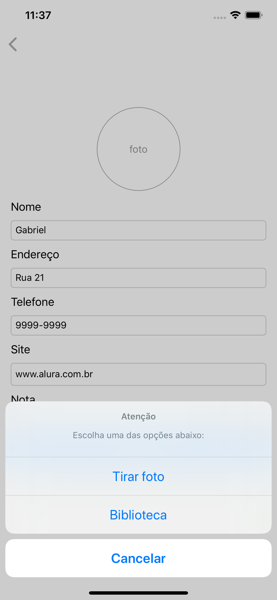
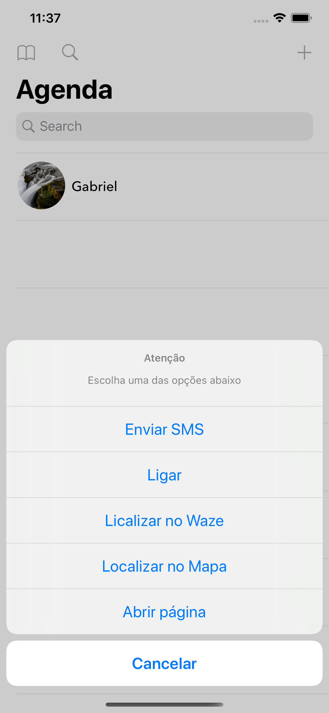
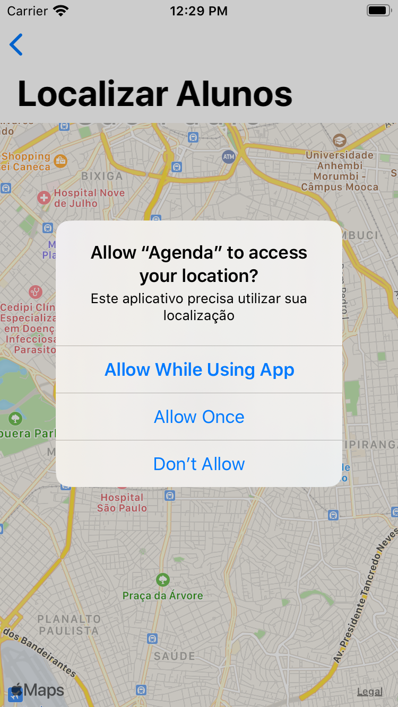
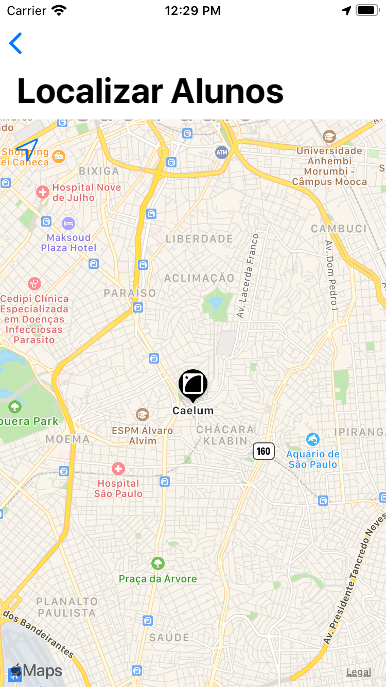

# 🍎 Agenda de Alunos - 2.0

Aplicativo de agenda de alunos 2.0, desenvolvido no curso: iOS - WebService e sincronização Offline. 
Com base no projeto Agenda 1.0, novas implementações e melhorias,
 

    
    
    
    
    

## 📖 O que foi abordado neste projeto?

- [x] **Cocoapods:** Gerenciador de depêndencias
- [x] **Alamofire:** Frawork requisições Http - 🔗 https://github.com/Alamofire/Alamofire
- [x] **applicationDidBecomeActive:** Sempre que o aplicativo se tornar ativo, sincronizar dos dados com o servidor 
- [x] **UIImage PickerController:** Biblioteca de fotos  
- [x] **CoreData:** persistência de dados local
- [x] **MFMessageCompose:** Envio de SMS
- [x] **UIApplication:** chamadas de Apps via URL Schema
- [x] **Integração com waze:** Chamadas ao Waze passando o destino via URL.
- [x] **Mapkit:** Utilização do mapa da apple 
- [x] **Core Location:** Utilização localização, conversão de endereço em latitude e longitude e GPS
- [x] **URL Request:** Chamadas de webservice nativamente
- [x] **Local Authentication:** autenticação local(Biometria, senha, etc)
- [x] **Shurtcut:** Atalhos do aplicativo na tela inicial
- [x] **Safari Service:** Abrir página na web no seu app
- [x] **Icons no app:** icones utilizando as guideline IOS, site: makeappicon.com

### ⚙️ Instalação do Cocoapod:
---
- **Step 1:** Abra o terminal na pasta do projeto
- **Step 2:** execute o comando: sudo gem install cocoapods
- **Step 3:** execute o comando: pod init
- **Step 4:** execute o comando: pod install

### 🖥️ Servidor localhost utilizado no projeto: 
---
Servidor esta localizado na pasta raiz do projeto **Servidor.zip**

**Requisitos:** 
- Java JDK 8 instalado

**⚙️ Inicialização:**

- **Step 1:** Descompactar arquivos.
- **Step 2:** Abra o terminal na pasta do servidor
- **Step 3:** Execute o comando: java -jar server.jar
