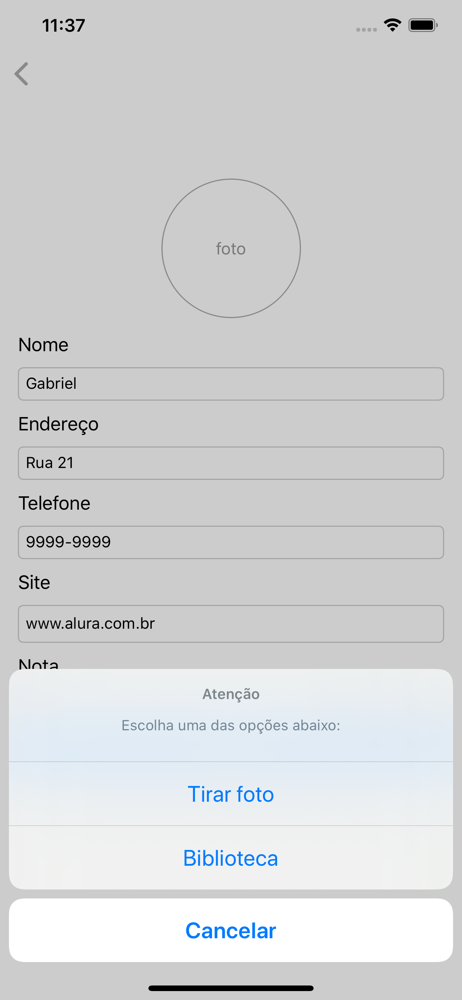
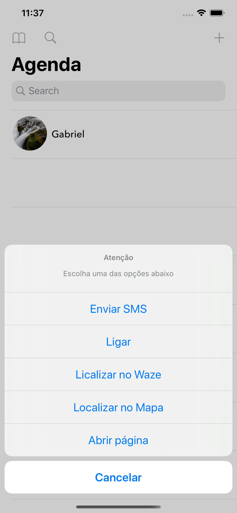
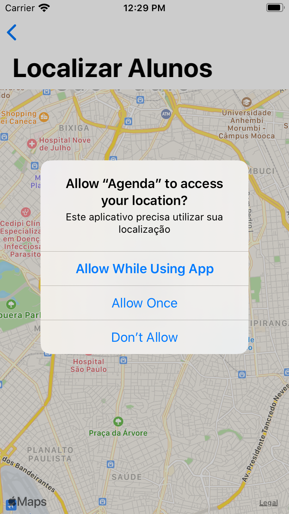
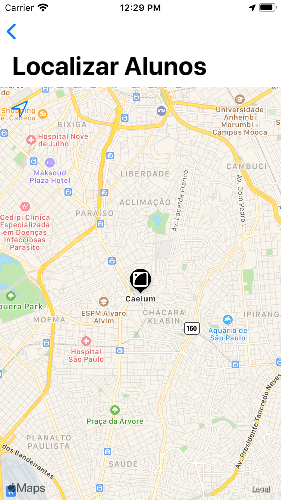
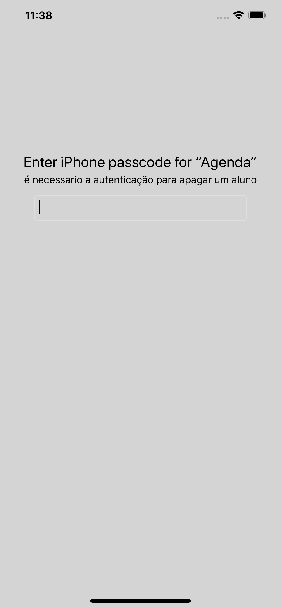

# Agenda de Alunos - 1.0

Aplicativo de agenda de alunos, desenvolvido no curso de IOS da Alura

    
    
    
    
    

## O que foi abordado neste projeto?

- [x] **UIImage PickerController:** Biblioteca de fotos  
- [x] **CoreData:** persistência de dados local
- [x] **MFMessageCompose:** Envio de SMS
- [x] **UIApplication:** chamadas de Apps via URL Schema
- [x] **Integração com waze:** Chamadas ao Waze passando o destino via URL.
- [x] **Mapkit:** Utilização do mapa da apple 
- [x] **Core Location:** Utilização localização, conversão de endereço em latitude e longitude e GPS
- [x] **URL Request:** Chamadas de webservice nativamente
- [x] **Local Authentication:** autenticação local(Biometria, senha, etc)
- [x] **Shurtcut:** Atalhos do aplicativo na tela inicial
- [x] **Safari Service:** Abrir página na web no seu app
- [x] **Icons no app:** icones utilizando as guideline IOS, site: makeappicon.com
