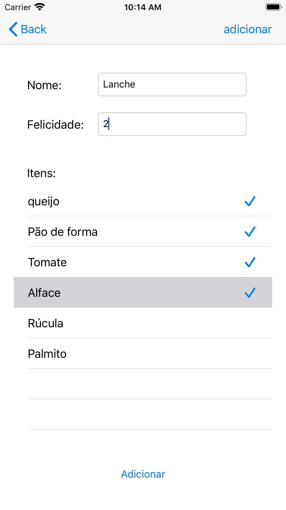

# Cadastro de Refeição

Aplicativo desenvolvimento no curso de Swift básico part 1-3 da Alura 

    

## O que foi abordado neste projeto?

- [x] **Storyboard e Xib**  
- [x] **Optionals, Unwrapping e forced Unwrapping**
- [x] **UIViewController, UITableViewDataSource, UITableViewDelegate** 
- [x] **Navigation Controller e Segue** 
- [x] **Protocol** 
- [x] **Delegate**
- [x] **Persistência Local**
- [x] **FileManager** 
- [x] **NsCoding - Encoded e decoded**
